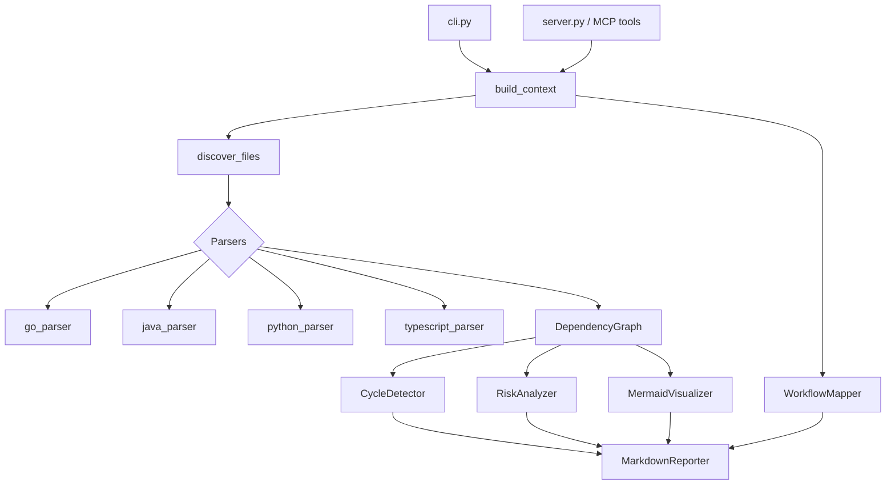

# Claude Codebase Analyzer

An MCP (Model Context Protocol) server that extends Claude Desktop with codebase
architecture analysis — dependency graphs, circular-dependency detection,
architectural risk scoring, and CI/CD workflow mapping — across Go, Java,
Python, and TypeScript/JavaScript.

---

## Features

| Capability | Tool | Description |
| --- | --- | --- |
| Dependency tree | `analyze_dependencies` | What a file imports and what imports it, to any depth. |
| Circular dependencies | `detect_circular_dependencies` | Finds cycles via Tarjan's SCC algorithm and suggests safe breakpoints. |
| Risk report | `generate_risk_report` | Scores every file 0-100 on complexity, dependency depth, cycles, churn, and test coverage. |
| Workflow mapping | `map_workflow` | Maps GitHub Actions / GitLab CI / Jenkins steps to the code they run, and flags uncovered files. |

### Supported languages

| Language | Extensions | Import resolution |
| --- | --- | --- |
| Go | `.go` | `go.mod` module prefix, stdlib detection, `vendor/` fallback |
| Java | `.java` | Maven/Gradle `src/main/java` layout, `java.*`/`javax.*` stdlib |
| Python | `.py`, `.pyi` | Relative imports, packages (`__init__.py`), `sys.stdlib_module_names` |
| TypeScript / JavaScript | `.ts`, `.tsx`, `.js`, `.jsx`, `.mjs`, `.cjs` | `tsconfig.json` `paths` aliases, extension + `index` resolution |

All parsing is done with [tree-sitter](https://tree-sitter.github.io/) — never
regex. The analyzer is strictly **read-only**; it never modifies your code.

---

## Installation

```bash
pip install claude-codebase-analyzer
```

Or from source:

```bash
git clone https://github.com/sourabhjha/claude-codebase-analyzer
cd claude-codebase-analyzer
pip install -e ".[dev,analysis]"
```

Requires Python 3.11+.

---

## Claude Desktop setup

1. Install the package (above) so the `claude-analyzer` command is on your PATH.
2. Add the server to your Claude Desktop config, pointing `PROJECT_ROOT` at the
   project you want to analyze:

   ```json
   {
     "mcpServers": {
       "codebase-analyzer": {
         "command": "claude-analyzer",
         "args": ["server"],
         "env": {
           "PROJECT_ROOT": "/path/to/your/project"
         }
       }
     }
   }
   ```

   The config file lives at:

   - **macOS:** `~/Library/Application Support/Claude/claude_desktop_config.json`
   - **Windows:** `%APPDATA%\Claude\claude_desktop_config.json`
   - **Linux:** `~/.config/Claude/claude_desktop_config.json`

3. Restart Claude Desktop.
4. Ask Claude, for example: *"Analyze the dependencies of src/main.py"* or
   *"Are there any circular dependencies in this project?"*

---

## CLI usage

The same analysis is available from the command line via `claude-analyzer`.

### Detect circular dependencies

```console
$ claude-analyzer cycles ./my-go-project
Analyzing /home/me/my-go-project ...
Parsed 3 files, 4 edges.
# Circular Dependencies

**Status:** 🟠 Moderate — found **1** circular dependency chain(s).

- **Largest cycle size:** 2 files
- **Files involved:** 2
- **By language:** go: 1
...
1. model.go → util.go → model.go
```

### Dependency tree

```console
$ claude-analyzer deps ./src/index.ts --project-root ./
# Dependency Tree: `index.ts`

​```text
index.ts
├── app.ts
│   ├── utils.ts
│   │   └── user.ts
│   └── index.ts  ↻ (cycle)
└── user.ts
​```
```

### Risk report

```console
$ claude-analyzer risk ./my-project --top-n 20
# Architectural Risk Report

## Summary
- 🔴 critical: 0 file(s)
- 🟠 high: 1 file(s)
- 🟡 medium: 3 file(s)
- 🟢 low: 18 file(s)
...
```

### Map a CI/CD workflow

```console
$ claude-analyzer workflow .github/workflows/ci.yml
# CI/CD Workflow Map
- Platform: github_actions
- Jobs: 2
...
```

### Full report (combined)

```console
$ claude-analyzer analyze ./my-project --output report.md
Report written to report.md
```

Pass `--format json` to any command that supports it for machine-readable output.

---

## Architecture



- **parsers/** — tree-sitter parsers, one per language, behind a common
  `BaseParser` interface.
- **graph/** — `DependencyGraph` (networkx), `CycleDetector` (SCC), and Mermaid/
  Graphviz visualizers.
- **analysis/** — `RiskAnalyzer` (weighted scoring), `WorkflowMapper`
  (CI/CD → code), and an optional Semgrep `VulnScanner`.
- **reporters/** — Markdown report generation with embedded Mermaid diagrams.
- **server.py** — the MCP server and the shared orchestration reused by the CLI.

### Risk scoring

Each file's 0-100 risk score is a weighted blend:

| Metric | Weight |
| --- | --- |
| Cyclomatic complexity | 25% |
| Dependency depth | 20% |
| Circular dependency | 30% |
| Change frequency (git, 90 days) | 15% |
| Test coverage estimate | 10% |

---

## Development

```bash
make install     # pip install -e ".[dev,analysis]"
make test        # pytest with coverage
make lint        # ruff check + format check
make typecheck   # mypy
make build       # build sdist + wheel
```

On Windows, run the underlying commands directly (e.g.
`python -m pytest --cov=src`) or use `make` from Git Bash.

---

## Contributing

1. Fork and create a feature branch.
2. Add tests for any new behavior (the suite targets ≥ 80% coverage).
3. Ensure `make lint`, `make typecheck`, and `make test` all pass.
4. Open a pull request describing the change and its motivation.

New language support is added by implementing a `BaseParser` subclass in
`parsers/` and registering it in `parsers/__init__.py`.

---

## License

MIT — see below.

```
MIT License

Copyright (c) 2026 Sourabh Jha

Permission is hereby granted, free of charge, to any person obtaining a copy
of this software and associated documentation files (the "Software"), to deal
in the Software without restriction, including without limitation the rights
to use, copy, modify, merge, publish, distribute, sublicense, and/or sell
copies of the Software, and to permit persons to whom the Software is
furnished to do so, subject to the following conditions:

The above copyright notice and this permission notice shall be included in all
copies or substantial portions of the Software.

THE SOFTWARE IS PROVIDED "AS IS", WITHOUT WARRANTY OF ANY KIND, EXPRESS OR
IMPLIED, INCLUDING BUT NOT LIMITED TO THE WARRANTIES OF MERCHANTABILITY,
FITNESS FOR A PARTICULAR PURPOSE AND NONINFRINGEMENT. IN NO EVENT SHALL THE
AUTHORS OR COPYRIGHT HOLDERS BE LIABLE FOR ANY CLAIM, DAMAGES OR OTHER
LIABILITY, WHETHER IN AN ACTION OF CONTRACT, TORT OR OTHERWISE, ARISING FROM,
OUT OF OR IN CONNECTION WITH THE SOFTWARE OR THE USE OR OTHER DEALINGS IN THE
SOFTWARE.
```
