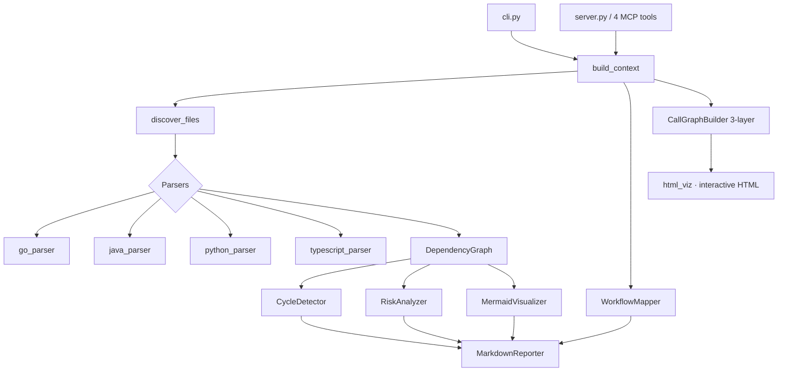

# Claude Codebase Analyzer

An **MCP (Model Context Protocol) server + CLI** that gives Claude — and you —
deep architectural insight into a codebase: dependency graphs, circular-dependency
detection, architectural risk scoring, CI/CD workflow mapping, and a
**self-contained interactive 3-layer dependency graph** you can explore in the
browser. Works across **Go, Java, Python, and TypeScript/JavaScript**.

All parsing is done with [tree-sitter](https://tree-sitter.github.io/) — never
regex — and the analyzer is strictly **read-only**: it never modifies your source.

---

## Features

### MCP tools (used from Claude Desktop / Claude Code)

| Capability | Tool | Description |
| --- | --- | --- |
| Dependency tree | `analyze_dependencies` | What a file imports and what imports it, to any depth, as an ASCII tree + Mermaid diagram. |
| Circular dependencies | `detect_circular_dependencies` | Finds cycles via Tarjan's SCC algorithm and suggests the least-disruptive edge to break. |
| Risk report | `generate_risk_report` | Scores every file 0–100 on complexity, dependency depth, cycles, churn, and test coverage. |
| Workflow mapping | `map_workflow` | Maps CI steps to the code they run and flags files never exercised by CI. |

### Interactive dependency graph (CLI)

The `graph` command renders a **single self-contained HTML file** (no internet,
no dependencies) with three levels of abstraction and click-to-drill-down:

1. **Directories** ↔ directories
2. **Files** ↔ files (intra- and inter-directory)
3. **Functions** ↔ functions (the call graph)

Click a directory to expand into its files; click a file to expand into its
functions; use the breadcrumb to climb back up. Pan, zoom, drag nodes, and hover
to focus a node and its neighbors.

### Supported languages

| Language | Extensions | Import resolution |
| --- | --- | --- |
| Go | `.go` | `go.mod` module prefix, stdlib detection, `vendor/` fallback |
| Java | `.java` | Maven/Gradle `src/main/java` layout, `java.*`/`javax.*` stdlib |
| Python | `.py`, `.pyi` | Relative imports, packages (`__init__.py`), `sys.stdlib_module_names` |
| TypeScript / JavaScript | `.ts`, `.tsx`, `.js`, `.jsx`, `.mjs`, `.cjs` | `tsconfig.json` **and** `jsconfig.json` `paths` aliases (Next.js-friendly), extension + `index` resolution |

---

## Installation

```bash
pip install claude-codebase-analyzer
```

Or from source:

```bash
git clone https://github.com/sourabhjha/claude-codebase-analyzer
cd claude-codebase-analyzer
pip install -e ".[dev,analysis]"
```

Requires **Python 3.11+**.

---

## Use it with Claude Desktop

1. Install the package so the `claude-analyzer` command is on your PATH.
2. Add the server to your Claude Desktop config, pointing `PROJECT_ROOT` at the
   project you want analyzed:

   ```json
   {
     "mcpServers": {
       "codebase-analyzer": {
         "command": "claude-analyzer",
         "args": ["server"],
         "env": {
           "PROJECT_ROOT": "/path/to/your/project"
         }
       }
     }
   }
   ```

   Config file locations:

   - **macOS:** `~/Library/Application Support/Claude/claude_desktop_config.json`
   - **Windows:** `%APPDATA%\Claude\claude_desktop_config.json`
   - **Linux:** `~/.config/Claude/claude_desktop_config.json`

3. Restart Claude Desktop, then ask: *"Are there any circular dependencies?"* or
   *"Generate a risk report."*

---

## Use it with Claude Code

Register the same server with the Claude Code CLI:

```bash
claude mcp add codebase-analyzer -s user \
  -e PROJECT_ROOT=/path/to/your/project \
  -- claude-analyzer server
```

> **Note:** MCP tools do not appear under `/` — that menu is for slash commands
> and prompts. Type `/mcp` to confirm the server is **connected**, then just ask
> in natural language. Restart Claude Code once after adding the server so it
> loads. Each registration is pinned to one `PROJECT_ROOT`.

---

## CLI usage

The same analysis is available from the command line via `claude-analyzer`.

### Interactive dependency graph

```console
$ claude-analyzer graph ./my-project
Analyzing /home/me/my-project ...
Parsed 45 files, 74 edges.
Interactive graph written to /home/me/my-project/dependency-graph.html
12 directories · 45 files · 108 functions. Open it in a browser to explore all 3 layers.
```

Flags: `-o path.html` to choose the output location, `--no-open` to skip
launching the browser.

### Detect circular dependencies

```console
$ claude-analyzer cycles ./my-project
# Circular Dependencies

**Status:** 🟠 Moderate — found **1** circular dependency chain(s).
- **Largest cycle size:** 2 files
...
1. model.go → util.go → model.go
```

### Dependency tree

```console
$ claude-analyzer deps ./src/index.ts --project-root ./
# Dependency Tree: `index.ts`

​```text
index.ts
├── app.ts
│   ├── utils.ts
│   │   └── user.ts
│   └── index.ts  ↻ (cycle)
└── user.ts
​```
```

### Risk report

```console
$ claude-analyzer risk ./my-project --top-n 20
# Architectural Risk Report
## Summary
- 🔴 critical: 0 file(s)
- 🟠 high: 1 file(s)
- 🟡 medium: 3 file(s)
- 🟢 low: 18 file(s)
...
```

### Map a CI/CD workflow

```console
$ claude-analyzer workflow .github/workflows/ci.yml
# CI/CD Workflow Map
- Platform: github_actions
- Jobs: 2
...
```

### Full combined report

```console
$ claude-analyzer analyze ./my-project --output report.md
Report written to report.md
```

Pass `--format json` to `analyze` and `risk` for machine-readable output.

---

## Architecture



- **parsers/** — tree-sitter parsers (one per language) behind a common
  `BaseParser`; shared tree-sitter helpers and function/call symbol extraction
  live in `ts_utils.py`.
- **graph/** — `DependencyGraph` (networkx), `CycleDetector` (SCC), and Mermaid/
  Graphviz visualizers.
- **analysis/** — `RiskAnalyzer` (weighted scoring), `WorkflowMapper`
  (CI → code), `CallGraphBuilder` (the 3-layer model), and an optional Semgrep
  `VulnScanner`.
- **reporters/** — `markdown_gen.py` (Markdown reports with Mermaid) and
  `html_viz.py` (the self-contained interactive graph).
- **server.py** — the MCP server plus the orchestration reused by the CLI.

### Risk scoring

Each file's 0–100 risk score is a weighted blend:

| Metric | Weight | How it's measured |
| --- | --- | --- |
| Cyclomatic complexity | 25% | tree-sitter branch-point count |
| Dependency depth | 20% | longest downstream chain from the file |
| Circular dependency | 30% | fixed penalty if the file is in any cycle |
| Change frequency | 15% | git commits touching the file in the last 90 days |
| Test coverage | 10% | heuristic: presence of a corresponding test file |

---

## Limitations & roadmap

This is an honest list of where the tool is approximate or incomplete:

- **CI platform coverage** — GitHub Actions workflows are fully parsed.
  GitLab CI (`.gitlab-ci.yml`) and Jenkins (`Jenkinsfile`) are **detected but not
  yet parsed** into jobs/scripts. *(Planned.)*
- **No persistent AST cache yet** — the project re-parses on each run. A
  `.cache/claude-analyzer/` cache is configured but not yet wired up. *(Planned.)*
- **Function call graph is best-effort** — calls are resolved statically (local →
  imported dependency → globally-unique name). Dynamic dispatch, duck-typed
  calls, and JSX `<Component/>` usage are not traced, so the function layer is
  richer on Python/Go/Java than on React/JSX codebases. Unresolved calls are
  reported in the graph stats.
- **Test coverage is a heuristic**, not real coverage data (it checks for a
  matching test file rather than running `coverage.py`).
- **Vulnerability scanning is optional** and requires `semgrep` on the PATH;
  without it, that step is skipped gracefully.

Contributions toward any of these are welcome.

---

## Development

```bash
make install     # pip install -e ".[dev,analysis]"
make test        # pytest with coverage (target ≥ 80%)
make lint        # ruff check + format check
make typecheck   # mypy
make build       # build sdist + wheel
```

On Windows, run the underlying commands directly (e.g.
`python -m pytest --cov=src`) or use `make` from Git Bash. The test suite ships
sample projects under `test_fixtures/` (each with a deliberate cycle).

---

## Contributing

1. Fork and create a feature branch.
2. Add tests for any new behavior (the suite targets ≥ 80% coverage).
3. Ensure `make lint`, `make typecheck`, and `make test` all pass.
4. Open a pull request describing the change and its motivation.

New language support is added by implementing a `BaseParser` subclass in
`parsers/` and registering it in `parsers/__init__.py`.

---

## License

MIT — see [LICENSE](LICENSE).
